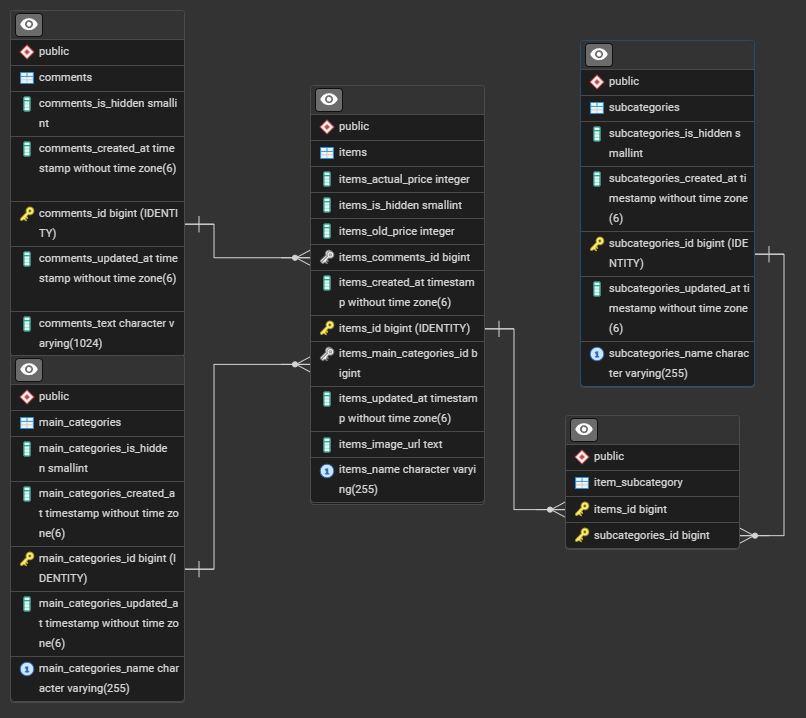

# Suhi Shop Web Page
Web page where you can buy sushi.

## Table of contents
* [Technologies Used](#technologies-used)
* [Features](#features)
* [Screenshots](#screenshots)
* [Project Status](#project-status)
* [Setup](#setup)
* [Licene](#licence)

## Technologies Used
- Java
- Spring Boot
- Hibernate
- PostgreSQL

## Features
- Lorem Ipsum

## Screenshots
>**Database diagram**
>

## Project Status
The project is in progress.

## Setup
_In progress_

## Licence
> [Full content of the licence](LICENSE).

MIT